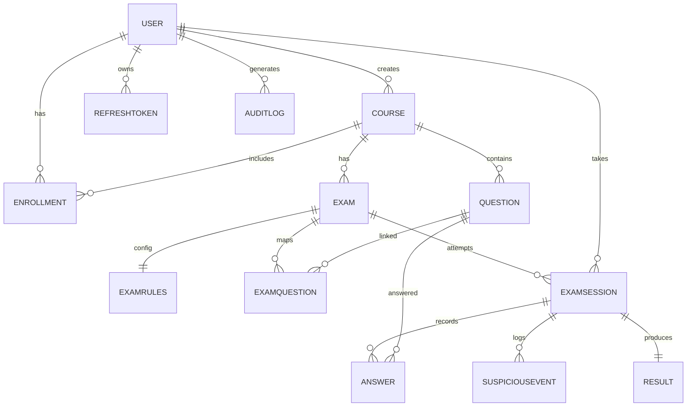

# Procto Database Design (PostgreSQL + Prisma)

This document describes the backend data model implemented in `backend/prisma/schema.prisma`.

## Overview

- **Database**: PostgreSQL
- **ORM**: Prisma
- **Total models**: 13
- **Design patterns**:
	- Soft deletes on core entities (`User`, `Course`, `Question`, `Exam`) via `deletedAt`
	- JSON fields for flexible payloads (`Question.content`, `Answer.response`)
	- Composite unique constraints to prevent duplicate enrollment/session/answers
	- Indexed foreign keys and high-frequency filters for query performance

## Enums

### `UserRole`
`STUDENT`, `FACULTY`, `ADMIN`

### `ExamStatus`
`DRAFT`, `SCHEDULED`, `ACTIVE`, `COMPLETED`, `ARCHIVED`

### `SessionStatus`
`PENDING`, `ACTIVE`, `SUBMITTED`, `TERMINATED`, `INVALIDATED`

### `QuestionType`
`MULTIPLE_CHOICE`, `MULTIPLE_SELECT`, `TRUE_FALSE`, `SHORT_ANSWER`, `ESSAY`, `FILL_BLANK`, `NUMERICAL`, `CODE`

### `EventType`
`FACE_NOT_DETECTED`, `MULTIPLE_FACES`, `LOOKING_AWAY`, `TAB_SWITCH`, `NOISE_DETECTED`, `SCREEN_EXIT`, `COPY_PASTE`, `RIGHT_CLICK`

### `EventSeverity`
`LOW`, `MEDIUM`, `HIGH`

## Core Model Summary

| Model | Purpose | Key Fields |
|---|---|---|
| `User` | Identity and account profile | `email` (unique), `role`, OAuth provider fields, verification/active flags |
| `RefreshToken` | Session continuation and revocation | `tokenHash` (unique), `expiresAt`, `revoked` |
| `AuditLog` | Compliance and traceability | `action`, `resourceType`, `resourceId`, `timestamp` |
| `Course` | Faculty-owned course container | `code` (unique), `facultyId`, `isActive` |
| `Enrollment` | Student-course membership | `courseId + studentId` (unique pair), `droppedAt` |
| `Question` | Reusable question bank entry | `type`, `content` (JSON), `points`, `topicTags[]` |
| `Exam` | Scheduled assessment in a course | `status`, `startAt`, `endAt`, `durationMinutes`, `isPublished` |
| `ExamRules` | Exam-level configurable policies | shuffle flags, attempts, marking factor, proctoring thresholds |
| `ExamQuestion` | Join table mapping questions to exam | `examId + questionId` (unique), `orderIndex` |
| `ExamSession` | Student attempt for an exam | `examId + studentId` (unique), `status`, `trustScore` |
| `Answer` | Per-question response in a session | `sessionId + questionId` (unique), `response` (JSON), scores |
| `SuspiciousEvent` | Proctoring event evidence | `type`, `severity`, `screenshotUrl`, `timestamp` |
| `Result` | Finalized scoring outcome | `sessionId` (unique), `totalScore`, `percentage`, `passStatus` |

## Relationship Map

## Constraints and Integrity Rules

### Uniqueness
- `User.email`
- `User.provider + providerId`
- `Course.code`
- `Enrollment(courseId, studentId)`
- `ExamQuestion(examId, questionId)`
- `ExamSession(examId, studentId)`
- `Answer(sessionId, questionId)`
- `Result.sessionId`
- `RefreshToken.tokenHash`

### Referential behavior
- Cascading delete is explicitly configured for:
	- `ExamRules -> Exam`
	- `ExamQuestion -> Exam`
	- `Answer -> ExamSession`
	- `SuspiciousEvent -> ExamSession`
	- `Result -> ExamSession`
	- `RefreshToken -> User`

## Indexing Strategy

High-use indexes are defined for lookup and filtering paths:

- User: `email`, `role`
- Course: `code`, `facultyId`
- Enrollment: `studentId`, `courseId`
- Exam: `courseId`, `status`, `startAt`
- Question: `courseId`, `type`
- ExamQuestion: `examId`
- ExamSession: `examId`, `studentId`, `status`
- Answer: `sessionId`
- SuspiciousEvent: `sessionId`, `severity`
- RefreshToken: `userId`, `tokenHash`
- AuditLog: `userId`, `timestamp`

## Soft Delete Policy

The following entities retain rows after logical removal:

- `User.deletedAt`
- `Course.deletedAt`
- `Question.deletedAt`
- `Exam.deletedAt`

This supports recovery, forensic review, and audit-friendly retention.

## Notes

- `ExamRules` uses `negativeMarkingFactor` and `autoTerminate` in schema; these names should be reflected consistently in API and docs.
- `ExamSession.trustScore` defaults to `100.0` and is designed for dynamic proctoring penalties.
